# 開発環境の準備

まず最初に開発環境を構築します。必要なのは以下の3つです。

## Firefox Developer Edition

[Firefox Developer Edition — Mozilla](https://www.mozilla.org/ja/firefox/developer/)からダウンロードできます。Firefox Developer Editionを使うことでFirefoxOSシミュレータを使ったり実機へのアプリ転送ができます。

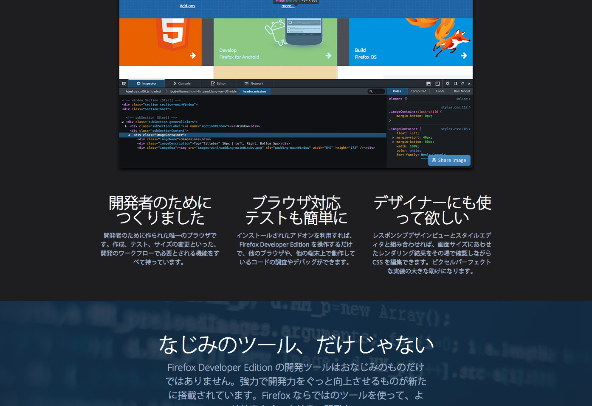

## ニフティクラウド mobile backendのアカウント

[mBaaSでサーバー開発不要！ | ニフティクラウド mobile backend](http://mb.cloud.nifty.com/) から取得できます。無料で使い始められます。

アカウントの取り方は、[ドットインストールの動画を参考](http://dotinstall.com/lessons/basic_ncmb/33302)にしてください。

アプリを新規取得するところまで行けば完了です。

## FirefoxOSデバイス

もちろんFirefoxOSデバイスも必要です。設定として、開発者向けデバイスに変更する必要があります。

設定アプリを立ち上げて、Device Informationを選択します。

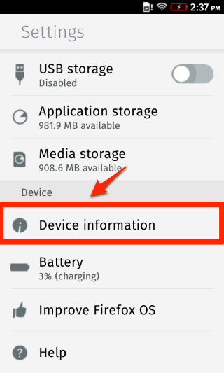

次にMore informationを選択します。

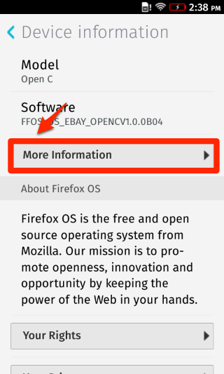

さらにDeveloperを選択し、

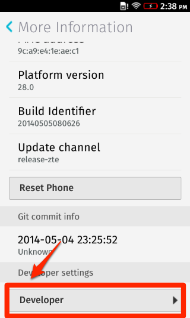

最後にDeveloper Menuをチェックします。これで開発者向けデバイスになります。

# FirefoxのWebIDEを起動する

ダウンロード&インストールしたら、まずは起動してみます。

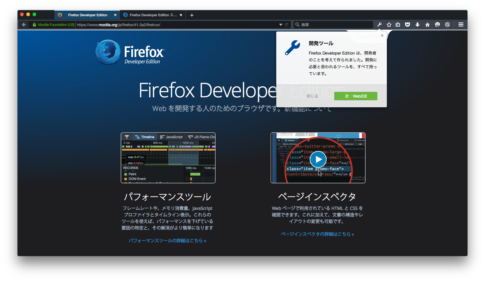

起動したら、アイコンまたはメニューからWebIDEを選択します（Shift + F8でもいけるはず）。

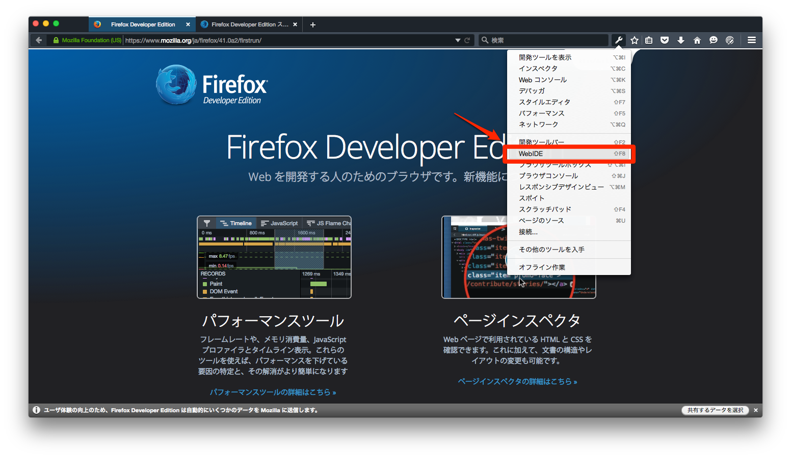

 WebIDEが起動すると、以下のような画面が表示されます。
 
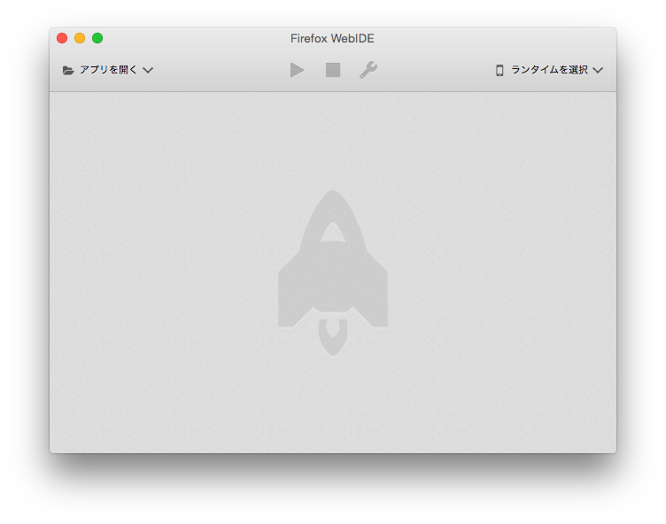

USBケーブルで実機とPCが説明されていると、USBデバイスのところに実機が表示されているはずです。

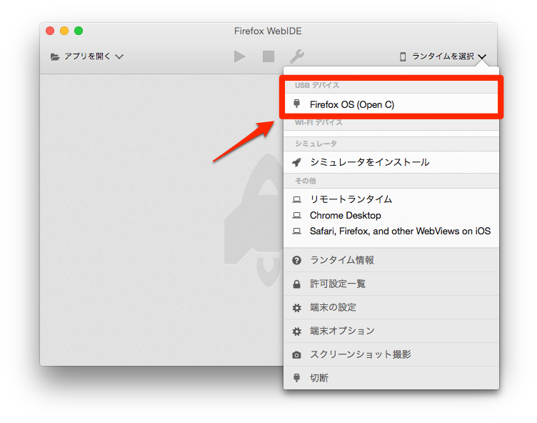

## 実機が表示されない場合

表示されない場合はFirefoxOSデバイスとPCの接続および開発者向けデバイスとしての登録がされているか確認してください。

また、下記の内容に従って確認してください。詳細は[au Firefox OS 関連技術情報](http://opensource.kddi.com/fx0/)にて確認できます。

### Windowsの場合

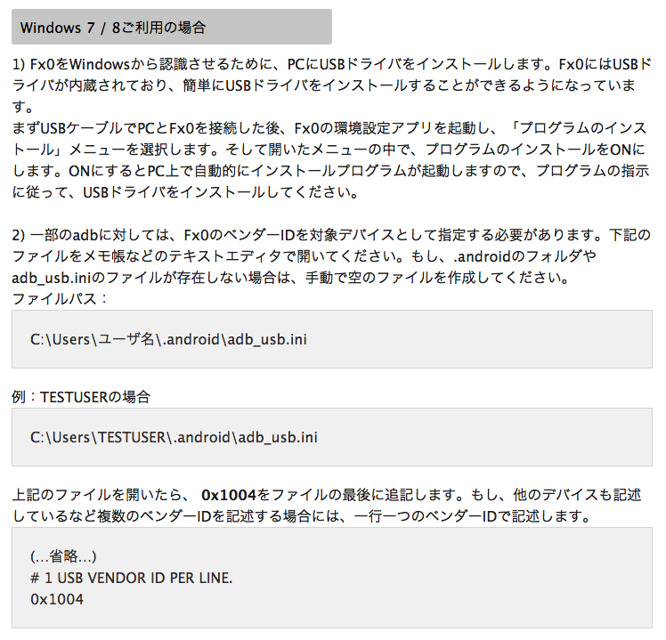

### Mac OSXの場合

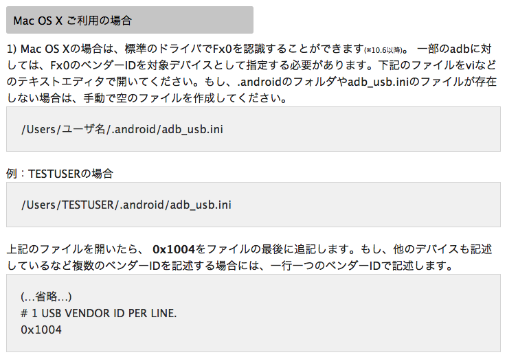

### Ubuntuの場合

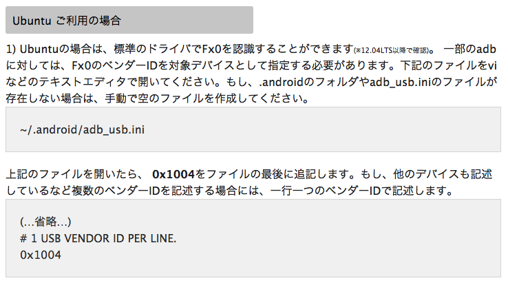

## 注意

今回はいきなり実機を使いますが、シミュレータを使う場合はWebIDEから自由にシミュレータをインストールすることができます。

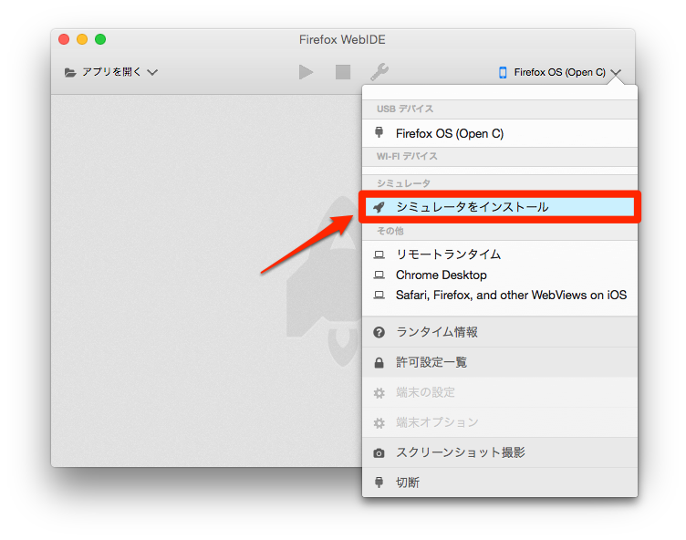

## まずはアプリを作ってみる

まず最初にアプリのベースを作ってみます。アプリを開くメニューから、新規アプリを作るを選択してください。

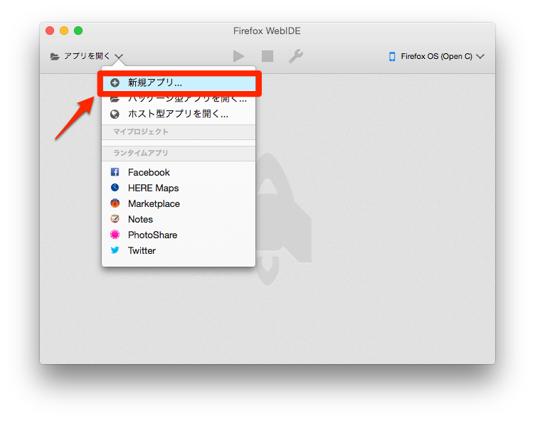

プロジェクト名は任意で構いませんが、ここでは SharePhoto と入力しています。テンプレートはHelloWorldとしてください。保存場所は適当な場所にしてください。

そうすると以下のようにファイルが展開されます。

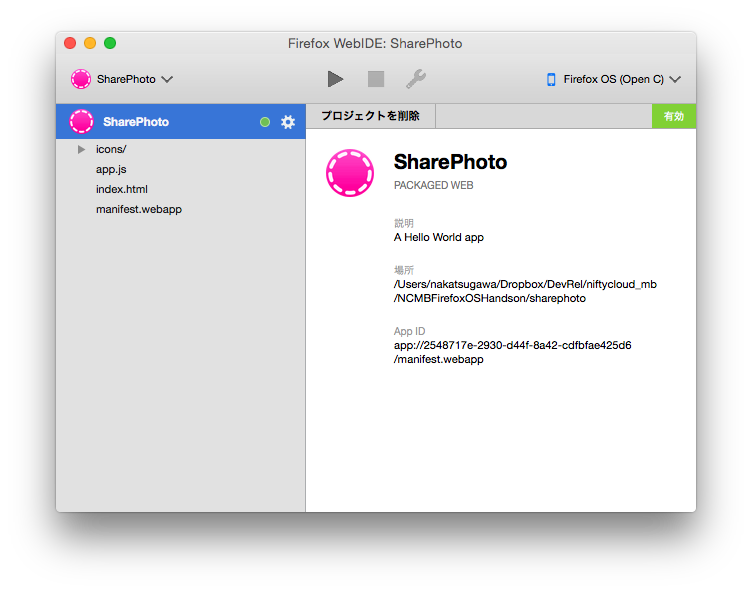

これをこのまま、上にある実行ボタンをクリックします。

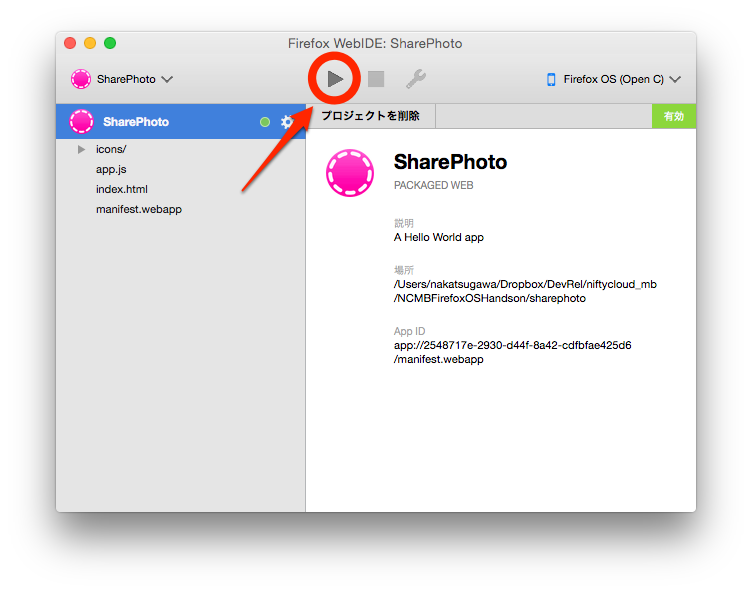

そうするとFirefoxOSデバイスにコードが転送され、Hello Worldと表示されればOKです。

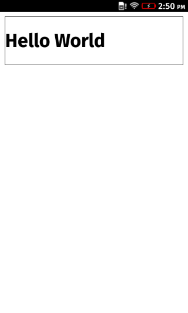

----

後はこのコードをベースにファイルを修正、実行を繰り返していくことになります。

なお、ここまでのコードは[NIFTYCloud-mbaas/NCMBFirefoxOSHandson at 0.1](https://github.com/NIFTYCloud-mbaas/NCMBFirefoxOSHandson/tree/0.1)として保存してあります。動かない場合は[Zipファイル](https://github.com/NIFTYCloud-mbaas/NCMBFirefoxOSHandson/archive/0.1.zip)をダウンロードして見比べてみてください。

続いて[ニフティクラウド mobile backendに触ってみよう](02.md)に進んでください。

