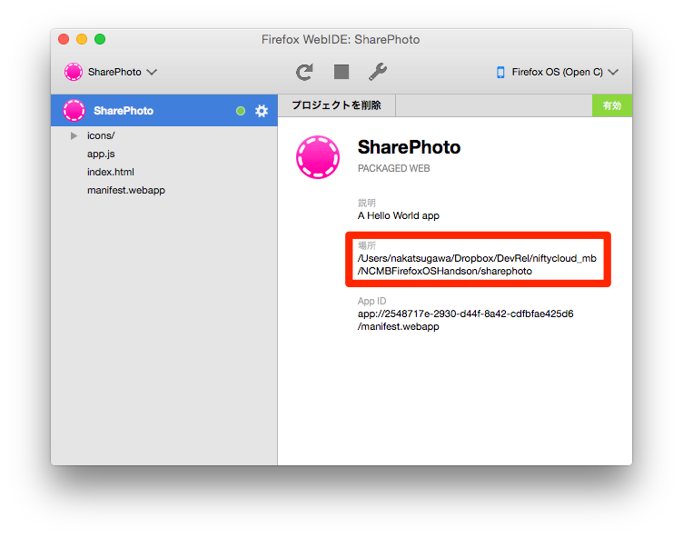
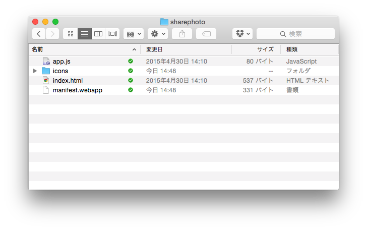
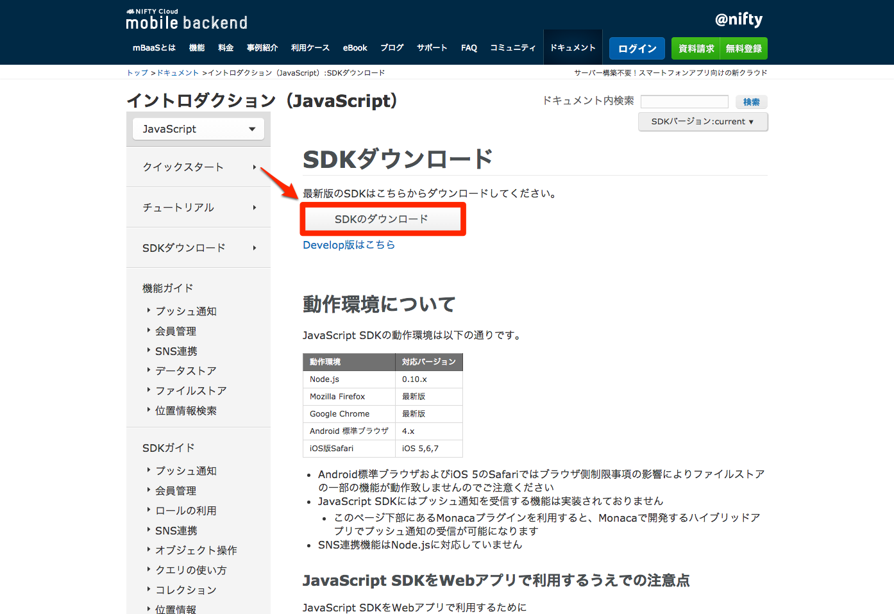
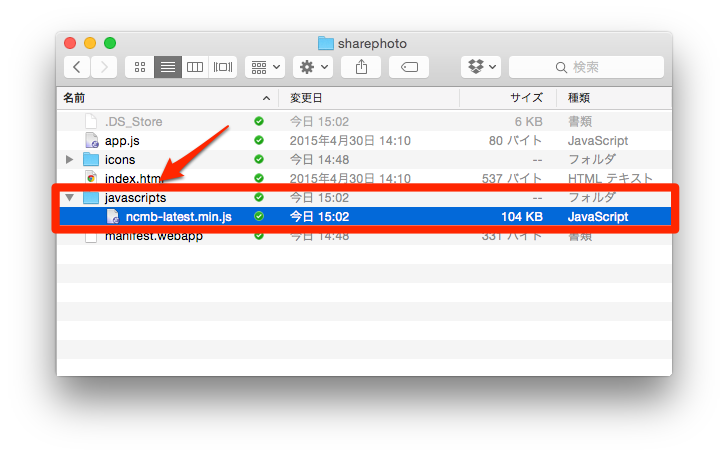
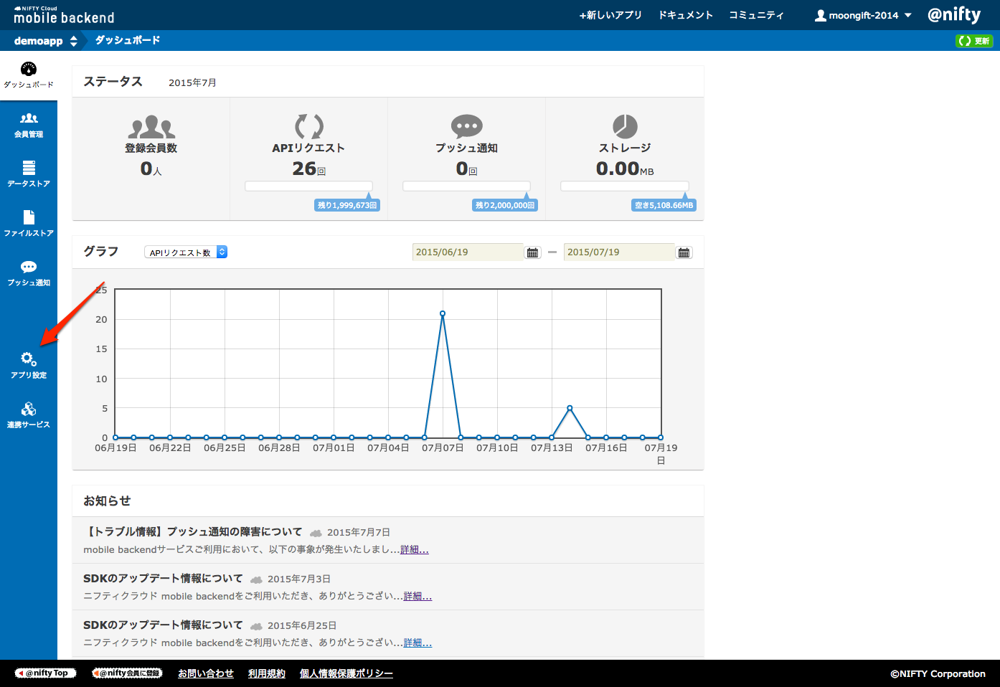
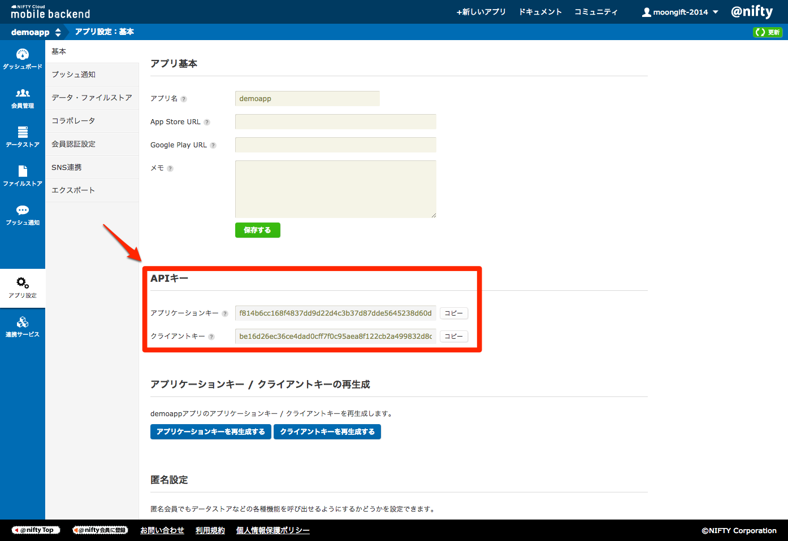
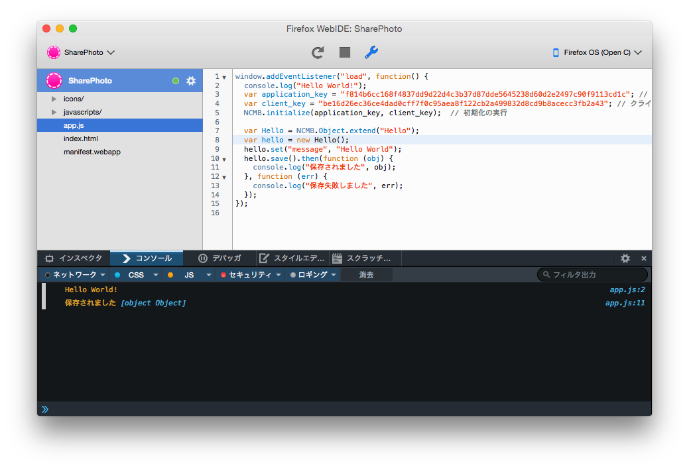
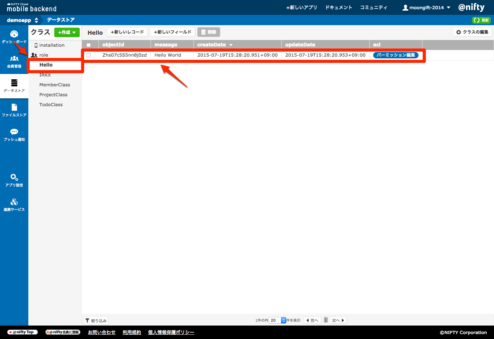

# ニフティクラウド mobile backendに触ってみよう

今回はFirefoxOSアプリにニフティクラウド mobile backendのJavaScript SDKを入れて、メッセージを飛ばしてみます。

ここまでの内容は[GitHubのmoongift/NCMBFirefoxOSHandson、0.1タグ](https://github.com/moongift/NCMBFirefoxOSHandson/archive/0.1.zip)よりダウンロードできます。

まずSharePhotoプロジェクトのパスをエクスプローラやFinderで開いてください。パスはプロジェクトのアイコンをクリックして、場所のところに表示されています。



エクスプローラなどで開くと、このようになっているはずです。



FirefoxOSのWebIDEはファイルのD&Dによる追加には対応していないので、ファイルの追加はエクスプローラーなどから行う形になります。

## ニフティクラウド mobile backendのJavaScript SDKをダウンロードする

JavaScript SDKは[イントロダクション (JavaScript) : SDKダウンロード | ニフティクラウド mobile backend](http://mb.cloud.nifty.com/doc/current/introduction/sdkdownload_javascript.html) からダウンロードできます。



なお、JavaScriptのコードがそのまま表示されると思うので、SharePhotoプロジェクトの中にjavascriptsフォルダを作成するなどして、その中に保存してください。

つまりこのようになります。



## index.htmlを編集する

まずindex.htmlを編集します。

1. JavaScript SDKを読み込む

を行います。

app.jsを読み込んでいるscriptタグの上で読み込みます。

```html
<script src="javascripts/ncmb-latest.min.js"></script> <!-- 追加 -->
<script src="app.js" defer></script>
```

とのようになります。

## app.jsを編集する

次にapp.jsを編集します。loadイベントの中でJavaScript SDKの初期化、およびデータ保存を行ってみます。

元のコードです。

```javascript
window.addEventListener("load", function() {
  console.log("Hello World!");
  
});
```

### JavaScript SDKの初期化

まずはニフティクラウド mobile backendの初期化を行います。

```javascript
window.addEventListener("load", function() {
  console.log("Hello World!");
  var application_key = "";
  var client_key = "";
  NCMB.initialize(application_key, client_key);  
});
```

ここで言うapplication_keyとclient_keyというのは[ニフティクラウド mobile backendの管理画面](http://console.mb.cloud.nifty.com/)にて確認できます。

管理画面に入った後、アプリ設定メニューをクリックします。



その中にあるAPIキーという項目に、

- アプリケーションキー（application_key）
- クライアントキー（client_key）

がそれぞれありますので、その文字列を使って `NCMB.initialize` を実行してください。



結果として以下のようなコードになります。

```javascript
window.addEventListener("load", function() {
  console.log("Hello World!");
  var application_key = "f814b6cc1...68f48"; // アプリケーションキー
  var client_key = "be16d...fb2a43"; // クライアントキー
  NCMB.initialize(application_key, client_key);  // 初期化の実行
});
```

### データの保存を行う

次にデータをクラウド上に保存する処理を行ってみましょう。初期化した後、次のようにコードを書きます。

```javascript
var Hello = NCMB.Object.extend("Hello");
var hello = new Hello();
hello.set("message", "Hello World");
hello.save().then(function (obj) {
  console.log("保存されました", obj);
}, function (err) {
  console.log("保存失敗しました", err);
});
```

ここからは上記コードの解説です。

まず最初の行ですが、データストアに対してクラスを定義しています。このクラス名は任意で、データストア上になければ自動的に生成されます。

```javascript
var Hello = NCMB.Object.extend("Hello"); // クラスの定義
```

次の行は定義したクラスに対してインスタンスを作っています。これはテーブルで言うところの行に相当するものです。

```javascript
var hello = new Hello();
```

次に生成したhelloに対してsetメソッドを使ってデータを設定しています。1つ名の引数がカラム名、2つ目が実際の値です。カラム名は自由に決められて、なければ自動的に生成されます。

```javascript
hello.set("message", "Hello World");
```

後はsaveメソッドで保存を実行します。Promiseに対応していますので、thenメソッドの1つ目の引数が成功時、2つ目の引数が失敗時のコールバックになります。

```javascript
hello.save().then(
  function() { /* 成功時 */}, 
  function() { /* 失敗時 */}
);
```

Promiseではなく、success、errorオプションを指定したコールバックも指定可能です。

```javascript
hello.save({
  success: function (obj) {
  	/* 成功時 */
  },
  error: function (err) {
  	/* 失敗時 */
  }
});
```

### app.jsの結果

app.jsは最終的に次のようなコードになっているはずです。

```javascript
window.addEventListener("load", function() {
  console.log("Hello World!");
  var application_key = "f814b6...3cd1c"; // アプリケーションキー
  var client_key = "be16...b2a43"; // クライアントキー
  NCMB.initialize(application_key, client_key);  // 初期化の実行  
  
  var Hello = NCMB.Object.extend("Hello");
  var hello = new Hello();
  hello.set("message", "Hello World");
  hello.save().then(function (obj) {
    console.log("保存されました", obj);
  }, function (err) {
    console.log("保存失敗しました", err);
  });
});
```

## 実行してみる

ではアプリを実機に転送して実行してみます。今回は画面は特に変更していませんので、WebIDEのメニューからアプリのデバッグ（F12）を選んでデバッグツールを表示してみます。



このように保存されました、と出ていれば問題ありません。

## ニフティクラウド mobile backendでも確認してみる

続いて[ニフティクラウド mobile backendの管理画面](https://console.mb.cloud.nifty.com/)でも確認してみましょう。データストアメニューを開いて、Helloというクラスが作られていること、そのレコードにHello Worldがあれば問題ありません。



----

ここまでの手順でFirefoxOSアプリとニフティクラウド mobile backendとを簡単に連携させられることが分かったかと思います。

なお、ここまでのコードは[moongift/NCMBFirefoxOSHandson at 0.2](https://github.com/moongift/NCMBFirefoxOSHandson/tree/0.2)として保存してあります。動かない場合は[Zipファイル](https://github.com/moongift/NCMBFirefoxOSHandson/archive/0.2.zip)をダウンロードして見比べてみてください。

次回は写真共有アプリのための画面と写真アップロード機能を作ってみたいと思います。


