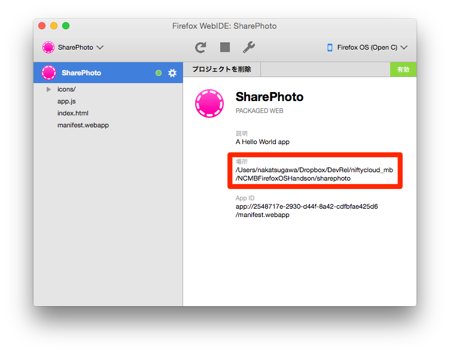
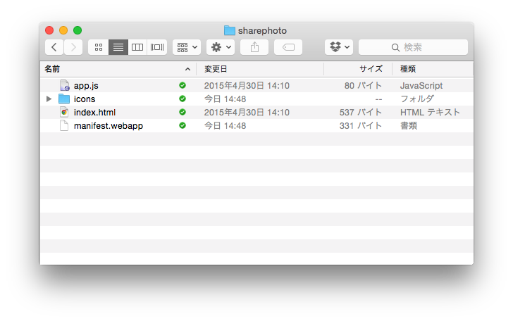
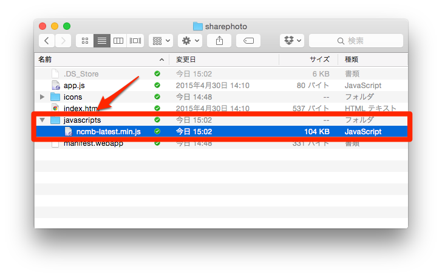

# 簡単にニフティクラウド mobile backendに触ってみよう

今回はFirefoxOSアプリにニフティクラウド mobile backendのJavaScript SDKを入れて、メッセージを飛ばしてみます。

まずSharePhotoプロジェクトのパスをエクスプローラやFinderで開いてください。パスはプロジェクトのアイコンをクリックして、場所のところに表示されています。

エクスプローラなどで開くと、このようになっているはずです。

FirefoxOSのWebIDEはファイルのD&Dによる追加には対応していないので、ファイルの追加はエクスプローラーなどから行う形になります。

## ニフティクラウド mobile backendのJavaScript SDKをダウンロードする

JavaScript SDKは[イントロダクション (JavaScript) : SDKダウンロード | ニフティクラウド mobile backend](http://mb.cloud.nifty.com/doc/current/introduction/sdkdownload_javascript.html) からダウンロードできます。

なお、JavaScriptのコードがそのまま表示されると思うので、SharePhotoプロジェクトの中にjavascriptsフォルダを作成するなどして、その中に保存してください。

つまりこのようになります。

