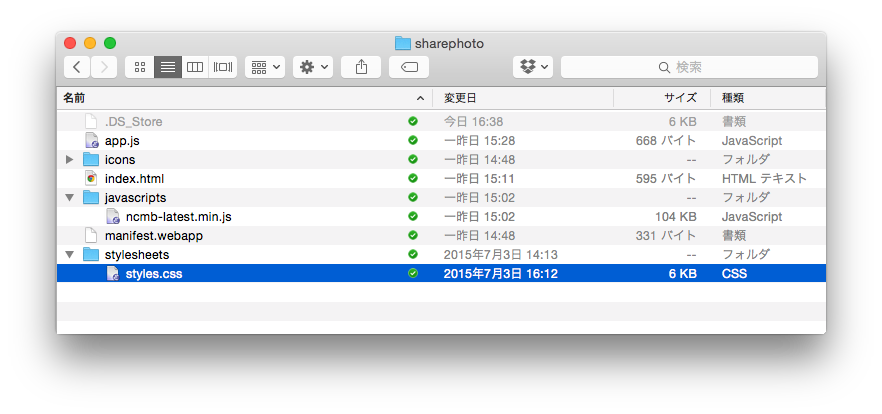
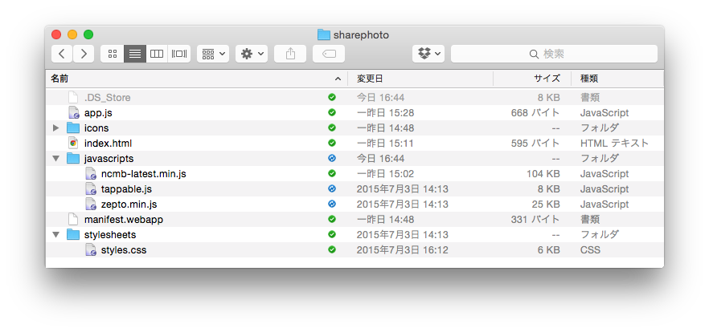
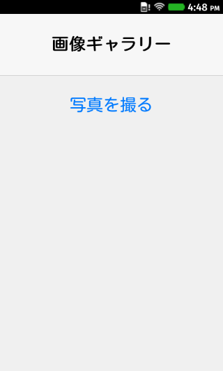
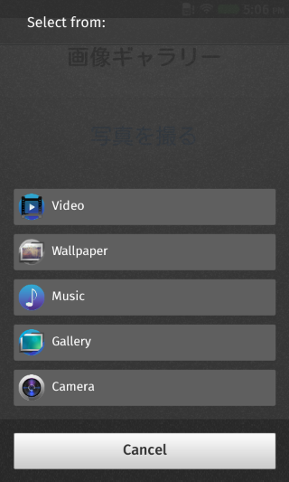
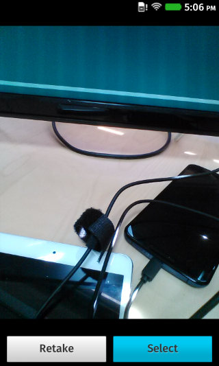
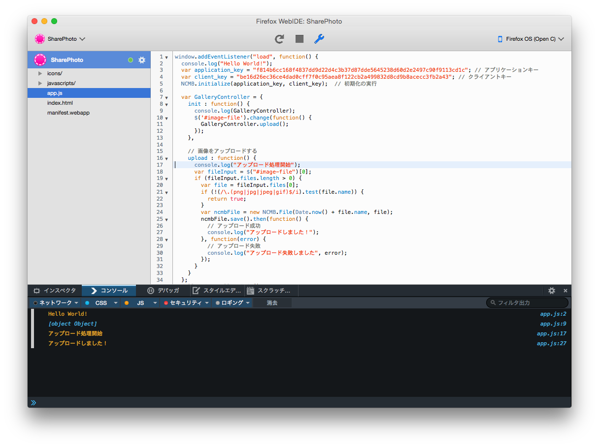

# 画面の設計と画像アップロード機能を作ってみる

前回まででニフティクラウド mobile backendを軽く触ってみましたので、今回は写真アップロードまで進めてみたいと思います。

## 画面を作る

### スタイルシートのダウンロード

まずアプリっぽい画面を作りますが、スタイルシートの説明などを細かく行っていると時間がかかるのでテンプレートを用意しました。[こちらのスタイルシートファイルをダウンロード](https://raw.githubusercontent.com/moongift/NCMBFirefoxOSHandson/master/sharephoto/stylesheets/styles.css)して、 `stylesheets/style.css` として保存してください。以下のようになります。



### JavaScriptファイルのダウンロード

次にJavaScriptライブラリをダウンロードしてください。以下に用意してありますので、すべて `javascripts` フォルダ以下に配置してください。

- [zepto.js](https://raw.githubusercontent.com/moongift/NCMBFirefoxOSHandson/master/sharephoto/javascripts/zepto.min.js)（jQuery代替。スマートフォン/タブレットに特化した分軽量）
- [tappable.js](https://raw.githubusercontent.com/moongift/NCMBFirefoxOSHandson/master/sharephoto/javascripts/tappable.js)（指定した部分をタップ可能にするためのライブラリ）

ダウンロード&配置後のファイル構成は次のようになります。



### HTMLファイルについて

次にHTMLファイルを編集します。index.htmlを以下のように編集します。

```html
<!doctype html>
<html lang="ja">
  <head>
    <meta charset="utf-8">
    <meta name="viewport" content="width=device-width, height=device-height, initial-scale=1, maximum-scale=1, user-scalable=no">
    <title>ニフティクラウドmobile backend × FirefoxOSアプリ</title>
    <link rel="stylesheet" href="stylesheets/styles.css">
  </head>
  <body>
    <!-- ヘッダー -->
    <header id="top-toolbar">
      <h1>画像ギャラリー</h1>
    </header>

    <!-- 写真を撮るためのボタン -->
    <div class="no-border-button tappable" style="position : relative">
      写真を撮る
      <form action="">
	<input type="file" id="image-file" name="image" style="opacity: 0.0; position : absolute; left : 0; right : 0; top : 0; bottom : 0; z-index : 20;" />
      </form>
    </div>

    <!-- JavaScriptライブラリの読み込み -->
    <script src="javascripts/ncmb-latest.min.js"></script>
    <script src="javascripts/tappable.js"></script>
    <script src="javascripts/zepto.min.js"></script>
    <script src="app.js"></script>
  </body>
</html>
```

ここまでの変更を行ったらWebIDEの再読込ボタンを押して、アプリをリロードしてみます。以下のように表示されればOKです。



### 写真のアップロード処理を作る

では実際の写真アップロード処理を作ってみます。 `app.js` を編集します。全体のコードは次のようになります。

前回作ったデータストアに保存する処理は消してあります。その代わり GalleryController という変数が追加してあります。

```javascript
window.addEventListener("load", function() {
  console.log("Hello World!");
  var application_key = "f814b6cc168f4837dd9d22d4c3b37d87dde5645238d60d2e2497c90f9113cd1c"; // アプリケーションキー
  var client_key = "be16d26ec36ce4dad0cff7f0c95aea8f122cb2a499832d8cd9b8acecc3fb2a43"; // クライアントキー
  NCMB.initialize(application_key, client_key);  // 初期化の実行  
  
  var GalleryController = {
    init : function() {
      $('#image-file').change(function() {
        GalleryController.upload();
      });
    },
    
    // 画像をアップロードする
    upload : function() {
      console.log("アップロード処理開始");
      var fileInput = $("#image-file")[0];
      if (fileInput.files.length > 0) {
        var file = fileInput.files[0];            
        if (!(/\.(png|jpg|jpeg|gif)$/i).test(file.name)) {
          return true;
        }
        var ncmbFile = new NCMB.File(Date.now() + file.name, file);
        ncmbFile.save().then(function() {
          // アップロード成功
          console.log("アップロードしました！");
        }, function(error) {
          // アップロード失敗
          console.log("アップロード失敗しました", error);
        });
      }
    }
  };
  GalleryController.init();
});
```

GalleryController.init()を最後に実行しています。これはファイルアップロードで写真が選ばれたら発火するイベントです。

```
    init : function() {
      $('#image-file').change(function() {
        GalleryController.upload();
      });
    },
```

実際のアップロード処理は次のようになっています。

```
    upload : function() {
      console.log("アップロード処理開始");
      var fileInput = $("#image-file")[0];
      if (fileInput.files.length > 0) {
        var file = fileInput.files[0];            
        if (!(/\.(png|jpg|jpeg|gif)$/i).test(file.name)) {
          return true;
        }
        var ncmbFile = new NCMB.File(Date.now() + file.name, file);
        ncmbFile.save().then(function() {
          // アップロード成功
          console.log("アップロードしました！");
        }, function(error) {
          // アップロード失敗
          console.log("アップロード失敗しました", error);
        });
      }
    }
```

ファイルを受け取り（`var fileInput = $("#image-file")[0];`）、画像であればNCMB.Fileオブジェクトを作っています。ファイル名は時間を使っています。

```
var ncmbFile = new NCMB.File(Date.now() + file.name, file);
```

後はデータストアの時と同じようにsave()を実行してクラウド上に保存しています。こちらもPromiseに対応していますのでthen()メソッドで結果を受け取っています。

## 実行してみる

ではアプリを実機に転送して実行してみましょう。写真を撮るをタップすると画像選択が出ます。



カメラを選択して撮影します。



カメラが閉じてファイルアップロード処理が実行されます。次のように **アップロードしました！** と出ればOKです。



----

今回はここまでになります。ここまでの内容は[moongift/NCMBFirefoxOSHandson at 0.3](https://github.com/moongift/NCMBFirefoxOSHandson/tree/0.3)にて参考できます。また[Zipファイルをダウンロードできます](https://github.com/moongift/NCMBFirefoxOSHandson/archive/0.3.zip)ので躓いた場合は見比べてみてください。

次回はアップロードするだけでなく、撮影した写真を一覧表示してみたいと思います。
