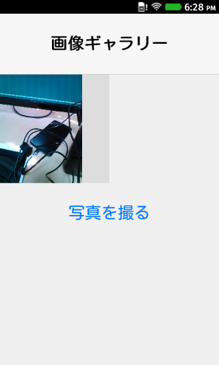
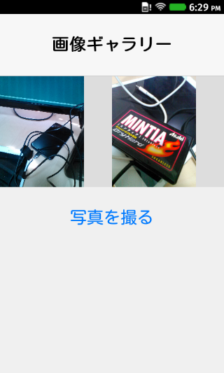

# mBaaSにアップロードした画像を表示する

前回は写真をアップロードしましたので、今回はその写真を表示する処理を作ってみます。

## HTMLファイルを編集する

まずはindex.htmlを編集します。具体的には以下を追加します。

```html
    <!-- 写真を並べて表示する部分 -->
    <div class="grid-table">
      <div class="grid-table-body">
      </div>
    </div>
    
    <!-- 写真を並べる時のテンプレート  ->
    <div class="templates">
      <div class="grid-table-cell tappable" id="grid-table-cell-template">
        
      </div>
    </div>
```

その結果、全体のHTMLファイルは次のようになります。

```html
<!doctype html>
<html lang="ja">
  <head>
    <meta charset="utf-8">
    <meta name="viewport" content="width=device-width, height=device-height, initial-scale=1, maximum-scale=1, user-scalable=no">
    <title>ニフティクラウドmobile backend × FirefoxOSアプリ</title>
    <link rel="stylesheet" href="stylesheets/styles.css">
  </head>
  <body>
    <!-- ヘッダー -->
    <header id="top-toolbar">
      <h1>画像ギャラリー</h1>
    </header>

    <!-- 写真を並べて表示する部分 -->
    <div class="grid-table">
      <div class="grid-table-body">
      </div>
    </div>
    
    <!-- 写真を並べる時のテンプレート  ->
    <div class="templates">
      <div class="grid-table-cell tappable" id="grid-table-cell-template">
        
      </div>
    </div>

    <!-- 写真を撮るためのボタン -->
    <div class="no-border-button tappable" style="position : relative">
      写真を撮る
      <form action="">
	<input type="file" id="image-file" name="image" style="opacity: 0.0; position : absolute; left : 0; right : 0; top : 0; bottom : 0; z-index : 20;" />
      </form>
    </div>

    <!-- JavaScriptライブラリの読み込み -->
    <script src="javascripts/ncmb-latest.min.js"></script>
    <script src="javascripts/tappable.js"></script>
    <script src="javascripts/zepto.min.js"></script>
    <script src="app.js"></script>
  </body>
</html>
```

## JavaScriptを編集

続いてapp.jsを編集します。mBaaSに問い合わせてアップロードされている写真を取得、表示します。

写真を並べて表示する処理を GalleryController.refresh() として定義します。

```javascript
var GalleryController = {
      :
    refresh : function() {
      var query = new NCMB.Query("file");
      query.find().then(function (files) {
          console.log(files);
          GalleryController.render(files);        	
        },
        function () {
          console.log(err);
        }
      );
    },
    render : function(files) {
      var cellTemplate = $('#grid-table-cell-template')[0];
      var fragment = document.createDocumentFragment();

      files.forEach(function(file) {
        console.log("file", file);
        var cell = cellTemplate.cloneNode(true);
        var objFile = new NCMB.File(file.get('fileName'), null, null, null);
        objFile.fetchImgSource($('img', cell).get(0));
        fragment.appendChild(cell);
      });
      console.log(fragment);
      $('.grid-table-body').empty().append(fragment); 
    }
};
```

見やすいように2つのメソッド、refreshとrenderに分けてあります。

### mBaaSから写真を取得する

写真を取得する処理はとてもシンプルです。NCMB.Queryという問い合わせ用オブジェクトを使って実行します。

```
        var query = new NCMB.Query("file");
        query.find().then(function (files) {
            GalleryController.render(files);        	
          },
          function () {
              console.log(err);
          }
        )
```

データの取得がうまくいったら、GalleryController.renderを実行するだけです。

表示処理は少し複雑ですが、次のようになっています。

```
    render : function(files) {
      // テンプレート
      var cellTemplate = $('#grid-table-cell-template')[0];
      
      // 空のHTML（ここに写真データを並べます）
      var fragment = document.createDocumentFragment();

      files.forEach(function(file) {
        console.log("file", file);
        var cell = cellTemplate.cloneNode(true);
        var objFile = new NCMB.File(file.get('fileName'), null, null, null);
        objFile.fetchImgSource($('img', cell).get(0));
        fragment.appendChild(cell);
      });
      
      console.log(fragment);
      $('.grid-table-body').empty().append(fragment); 
    }
```

まずNCMB.Fileを使ってファイル名からファイルオブジェクトを生成します。

```
var objFile = new NCMB.File(file.get('fileName'), null, null, null);
```

そして、ファイルオブジェクトから画像データを取り出すのは objFile.fetchImgSource になります。

```javascript
objFile.fetchImgSource($('img', cell).get(0));
```

そしてそれをHTMLテンプレート内に埋め込みつつ、fragmentの中に追加しています。

後はこの表示処理（refresh）を適当な場所で呼び出すだけです。例えば初期表示時と、写真の投稿完了時が良いでしょう。

```javascript
  var GalleryController = {
    init : function() {
      // ここにリフレッシュ処理追加
      GalleryController.refresh();
        :
    },
    
    // 画像をアップロードする
    upload : function() {
          :
        ncmbFile.save().then(function() {
          // アップロード成功
          // ここにリフレッシュ処理追加
          GalleryController.refresh();
        }, function(error) {
          // アップロード失敗
          console.log("アップロード失敗しました", error);
        });
      }
    },
```

app.js全体は次のようになります。

```
window.addEventListener("load", function() {
  console.log("Hello World!");
  var application_key = "f814b6...d1c"; // アプリケーションキー
  var client_key = "be16...a43"; // クライアントキー
  NCMB.initialize(application_key, client_key);  // 初期化の実行  
  
  var GalleryController = {
    init : function() {
      GalleryController.refresh();  // 写真のリストをリフレッシュ
      $('#image-file').change(function() {
        GalleryController.upload();
      });
    },
    
    // 画像をアップロードする
    upload : function() {
      console.log("アップロード処理開始");
      var fileInput = $("#image-file")[0];
      if (fileInput.files.length > 0) {
        var file = fileInput.files[0];            
        if (!(/\.(png|jpg|jpeg|gif)$/i).test(file.name)) {
          return true;
        }
        var ncmbFile = new NCMB.File(Date.now() + file.name, file);
        ncmbFile.save().then(function() {
          // アップロード成功
          console.log("アップロードしました！");
          GalleryController.refresh();  // 写真のリストをリフレッシュ
        }, function(error) {
          // アップロード失敗
          console.log("アップロード失敗しました", error);
        });
      }
    },
    
    // 写真データの取得
    refresh : function() {
      var query = new NCMB.Query("file");
      query.find().then(function (files) {
          console.log(files);
          GalleryController.render(files);        	
        },
        function () {
          console.log(err);
        }
      );
    },
    
    // 写真データの描画
    render : function(files) {
      var cellTemplate = $('#grid-table-cell-template')[0];
      var fragment = document.createDocumentFragment();

      files.forEach(function(file) {
        console.log("file", file);
        var cell = cellTemplate.cloneNode(true);
        var objFile = new NCMB.File(file.get('fileName'), null, null, null);
        objFile.fetchImgSource($('img', cell).get(0));
        fragment.appendChild(cell);
      });
      console.log(fragment);
      $('.grid-table-body').empty().append(fragment); 
    }

  };
  GalleryController.init();
});
```

## 実行してみる

では実際にアプリを起動してみます。起動すると写真が一覧になって表示されるのが分かるかと思います。



そして新しい写真を撮ると、写真の一覧がリフレッシュされて新しく撮った写真が一覧に追加されます。



----

今回はここまでになります。ここまでの内容は[NIFTYCloud-mbaas/NCMBFirefoxOSHandson at 0.4](https://github.com/NIFTYCloud-mbaas/NCMBFirefoxOSHandson/tree/0.4)にて参考できます。また[Zipファイルをダウンロードできます](https://github.com/NIFTYCloud-mbaas/NCMBFirefoxOSHandson/archive/0.4.zip)ので躓いた場合は見比べてみてください。

次回はいよいよ大詰めで、写真をタップした時にその写真だけを表示するようにしつつ、最後にコメントできる機能を追加したいと思います。

