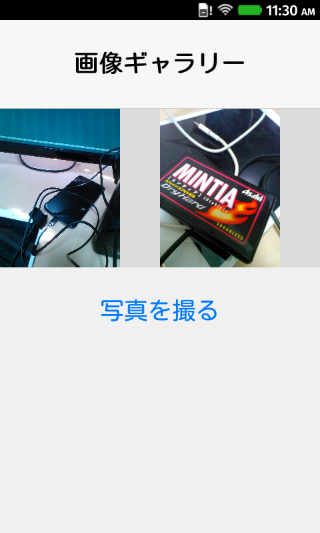
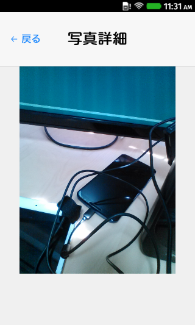

# 写真をタップしたら詳細画面を表示してみる

前回までで撮影した写真を表示するところまでできましたので、今回は写真をタップしたらその写真だけを表示する、いわゆる詳細画面を作るところまで行ってみたいと思います。

## app.jsの修正

まずapp.jsを修正します。前回までの内容は次の通りです。

```javascript
window.addEventListener("load", function() {
  console.log("Hello World!");
  var application_key = "cd9e16e539b6aa8bf567e90b95aec87472e3d957ec1183b535fa70f1f0067052"; // アプリケーションキー
  var client_key = "3de0306f0a03b8698040820f6cb309141011985af493e863a9504fd813e52c9f"; // クライアントキー
  NCMB.initialize(application_key, client_key);  // 初期化の実行  
  
  var GalleryController = {
    init : function() {
      console.log(GalleryController);
      GalleryController.refresh();
      $('#image-file').change(function() {
        GalleryController.upload();
      });
    },
    
    // 画像をアップロードする
    upload : function() {
      console.log("アップロード処理開始");
      var fileInput = $("#image-file")[0];
      if (fileInput.files.length > 0) {
        var file = fileInput.files[0];            
        if (!(/\.(png|jpg|jpeg|gif)$/i).test(file.name)) {
          return true;
        }
        
        // ファイルリーダーオブジェクト
        var reader = new FileReader();
        // 縮小画像を当てはめる画像オブジェクト
        var image = new Image();
        
        // ファイルリーダーで読み込んだら以下の処理を実行
        reader.onloadend = function() {
          
          // 画像オブジェクトに読み込んだら以下の処理を実行
          image.onload = function() {
            // 画像を加工するためのCanvasオブジェクト生成
            var canvas = $("<canvas />")[0];
            var max  = 200; // 加工する画像の幅
            ctx = canvas.getContext('2d');
            
            ctx.clearRect(0, 0, 0, 0);
            if (image.width < image.height) {
              // 縦長の場合
              canvas.height = max; // 高さ固定
              canvas.width  = max * image.width / image.height; // 加工後の画像の高さ
            }else{
              canvas.width  = max; // 幅固定
              canvas.height = max * image.height / image.width; // 加工後の画像の高さ
            }
            ctx.drawImage(image, 0, 0, canvas.width, canvas.height); // 縮小処理
            
            // toDataURLで取り出せるデータはBase64なのでBlobに変換します。
            var data = toBlob(canvas.toDataURL());
            
            // NCMB ファイルストレージの生成
            var ncmbFile = new NCMB.File(Date.now() + file.name, data, "image/png");
            
            // 保存処理
            ncmbFile.save().then(function() {
              // アップロード成功
              console.log("アップロードしました！");
              GalleryController.refresh();
            }, function(error) {
              // アップロード失敗
              console.log("アップロード失敗しました", error);
            });
          };
          
          // ファイルリーダーの結果を画像オブジェクトに適用
          image.src = reader.result;
        };
        
        // ファイルリーダーの読み込み処理開始
        reader.readAsDataURL(file);        
      }
    },

    refresh : function() {
      var query = new NCMB.Query("file");
      query.find().then(function (files) {
          console.log(files);
          GalleryController.render(files);          
        },
        function () {
          console.log(err);
        }
      );
    },
    
    render : function(files) {
      var cellTemplate = $('#grid-table-cell-template')[0];
      var fragment = document.createDocumentFragment();

      files.forEach(function(file) {
        console.log("file", file);
        var cell = cellTemplate.cloneNode(true);
        var objFile = new NCMB.File(file.get('fileName'), null, null, null);
        objFile.fetchImgSource($('img', cell).get(0));
        fragment.appendChild(cell);
      });
      console.log(fragment);
      $('.grid-table-body').empty().append(fragment); 
    }

  };
  GalleryController.init();
});

function toBlob(base64) {
  var bin = atob(base64.replace(/^.*,/, ''));
  var buffer = new Uint8Array(bin.length);
  for (var i = 0; i < bin.length; i++) {
    buffer[i] = bin.charCodeAt(i);
  }
  // Blobを作成
  try{
    var blob = new Blob([buffer.buffer], {
      type: 'image/png'
    });
  }catch (e){
    return false;
  }
  return blob;
}
```

### ファイル名をDOM上に保存する

mBaaSからファイルを取得する場合に必要になるのがファイル名です。上記のコード中でも次のような記述があります。

```javascript
var objFile = new NCMB.File(file.get('fileName'), null, null, null);
```

従って、写真をタップした時にタップされたファイル名が分かっている必要があります。そこで、タップ領域のdata-*にファイル名を残すようにします。

```javascript
var objFile = new NCMB.File(file.get('fileName'), null, null, null);
objFile.fetchImgSource($('img', cell).get(0));
// 以下を追加
$(cell).find("img").attr("data-filename", file.get('fileName')); // ファイル名を残す
```
### タップされた時のイベントを作成

そしてタップされた際のイベントで、詳細画面に遷移するようにします。detail.htmlはこの後、作成します。

```javascript
    init : function() {
        :
      // 追加ここから：写真をタップした時のイベント
      $('.grid-table-body').on('click', '.tappable', function(e) {
        location.href = 'detail.html#' + $(e.target).attr("data-filename");
      });
    },
```

この時、アンカーを使ってファイル名を渡すようにしています。これでindex.htmlとdetail.htmlでデータの授受ができるようになります。

### 読む込むコントローラを変える

これまではGalleryControllerしかありませんでしたが、詳細画面に入った時には別なコントローラPhotoControllerを読み込むようにしたいと思います。そこで、GalleryController.init();の処理を次のように書き換えます。

```javascript
  if (document.location.pathname == "/index.html") {
    // これまで通り
    GalleryController.init();
  }else{
    // 追加
    PhotoController.init();
  }
```

今回はファイルが2つなのでこれで良いですが、もっと増えた場合を想定してファイルを分割したり、動的に読み込む仕組みにしても良いでしょう。

## detail.htmlを作る

次にdetail.htmlを作成します。index.htmlと同じ階層でファイルを作成します。

内容としては以下のようになります。

```html
<!doctype html>
<html lang="ja">
  <head>
    <meta charset="utf-8">
    <meta name="viewport" content="width=device-width, height=device-height, initial-scale=1, maximum-scale=1, user-scalable=no">
    <title>ニフティクラウドmobile backend × FirefoxOSアプリ</title>
    <link rel="stylesheet" href="stylesheets/styles.css">
  </head>
  <body>
    <header id="top-toolbar">
      <h1>写真詳細</h1>
      <div class="top-toolbar-left">
	<div class="toolbar-button tappable" id="back">← 戻る</div>
      </div>
    </header>

    <div class="table">
      
    </div>

    <script src="javascripts/ncmb-latest.min.js"></script>
    <script src="javascripts/tappable.js"></script>
    <script src="javascripts/zepto.min.js"></script>
    <script src="app.js"></script>
  </body>
</html>
```

div.table img の中に写真を表示するだけです。

## PhotoControllerを作る

ではapp.js内にPhotoControllerを定義したいと思います。

```javascript
  var PhotoController = {
    init : function() {
      this.filename = location.hash.replace(/^#/, "");
      // 戻るをタップした時の処理
      $('#back').on('click', function() {
        location.href = 'index.html';
      });
      // 写真を表示
      this.show();
    },
    
    // 写真の表示処理を行う
    show: function () {
      var objFile = new NCMB.File(this.filename, null, null, null);
      objFile.fetchImgSource($('#img').get(0));
    },    
  };
```

初期化処理（init）でlocation.hashからファイル名を受け取っています。後は this.showを実行して写真の表示処理を行っています。

ここまでの app.js の内容は以下の通りです。

```javascript
window.addEventListener("load", function() {
  console.log("Hello World!");
  var application_key = "cd9e16e539b6aa8bf567e90b95aec87472e3d957ec1183b535fa70f1f0067052"; // アプリケーションキー
  var client_key = "3de0306f0a03b8698040820f6cb309141011985af493e863a9504fd813e52c9f"; // クライアントキー
  NCMB.initialize(application_key, client_key);  // 初期化の実行  
  
  var GalleryController = {
    init : function() {
      console.log(GalleryController);
      GalleryController.refresh();
      $('#image-file').change(function() {
        GalleryController.upload();
      });
    },
    
    // 画像をアップロードする
    upload : function() {
      console.log("アップロード処理開始");
      var fileInput = $("#image-file")[0];
      if (fileInput.files.length > 0) {
        var file = fileInput.files[0];            
        if (!(/\.(png|jpg|jpeg|gif)$/i).test(file.name)) {
          return true;
        }
        
        // ファイルリーダーオブジェクト
        var reader = new FileReader();
        // 縮小画像を当てはめる画像オブジェクト
        var image = new Image();
        
        // ファイルリーダーで読み込んだら以下の処理を実行
        reader.onloadend = function() {
          
          // 画像オブジェクトに読み込んだら以下の処理を実行
          image.onload = function() {
            // 画像を加工するためのCanvasオブジェクト生成
            var canvas = $("<canvas />")[0];
            var max  = 200; // 加工する画像の幅
            ctx = canvas.getContext('2d');
            
            ctx.clearRect(0, 0, 0, 0);
            if (image.width < image.height) {
              // 縦長の場合
              canvas.height = max; // 高さ固定
              canvas.width  = max * image.width / image.height; // 加工後の画像の高さ
            }else{
              canvas.width  = max; // 幅固定
              canvas.height = max * image.height / image.width; // 加工後の画像の高さ
            }
            ctx.drawImage(image, 0, 0, canvas.width, canvas.height); // 縮小処理
            
            // toDataURLで取り出せるデータはBase64なのでBlobに変換します。
            var data = toBlob(canvas.toDataURL());
            
            // NCMB ファイルストレージの生成
            var ncmbFile = new NCMB.File(Date.now() + file.name, data, "image/png");
            
            // 保存処理
            ncmbFile.save().then(function() {
              // アップロード成功
              console.log("アップロードしました！");
              GalleryController.refresh();
            }, function(error) {
              // アップロード失敗
              console.log("アップロード失敗しました", error);
            });
          };
          
          // ファイルリーダーの結果を画像オブジェクトに適用
          image.src = reader.result;
        };
        
        // ファイルリーダーの読み込み処理開始
        reader.readAsDataURL(file);        
      }
    },

    refresh : function() {
      var query = new NCMB.Query("file");
      query.find().then(function (files) {
          console.log(files);
          GalleryController.render(files);          
        },
        function () {
          console.log(err);
        }
      );
    },
    
    render : function(files) {
      var cellTemplate = $('#grid-table-cell-template')[0];
      var fragment = document.createDocumentFragment();

      files.forEach(function(file) {
        console.log("file", file);
        var cell = cellTemplate.cloneNode(true);
        var objFile = new NCMB.File(file.get('fileName'), null, null, null);
        objFile.fetchImgSource($('img', cell).get(0));
        // 以下を追加
        $(cell).find("img").attr("data-filename", file.get('fileName')); // ファイル名を残す
        fragment.appendChild(cell);
      });
      console.log(fragment);
      $('.grid-table-body').empty().append(fragment); 
    }

  };
  GalleryController.init();
});

var PhotoController = {
    init : function() {
      this.filename = location.hash.replace(/^#/, "");
      // 戻るをタップした時の処理
      $('#back').on('click', function() {
        location.href = 'index.html';
      });
      // 写真を表示
      this.show();
    },
    
    // 写真の表示処理を行う
    show: function () {
      var objFile = new NCMB.File(this.filename, null, null, null);
      objFile.fetchImgSource($('#img').get(0));
    },    
  };

  if (document.location.pathname == "/index.html") {
    // これまで通り
    GalleryController.init();
  }else{
    // 追加
    PhotoController.init();
  }
});

function toBlob(base64) {
  var bin = atob(base64.replace(/^.*,/, ''));
  var buffer = new Uint8Array(bin.length);
  for (var i = 0; i < bin.length; i++) {
    buffer[i] = bin.charCodeAt(i);
  }
  // Blobを作成
  try{
    var blob = new Blob([buffer.buffer], {
      type: 'image/png'
    });
  }catch (e){
    return false;
  }
  return blob;
}
```

## 実行してみる

では実際にアプリを実行してみます。

アプリが立ち上がると写真一覧が出るのは変わりません。



写真をタップすると詳細画面に遷移して、選んだ写真だけが表示されます。



----

画面ごとのデータ受け渡しについてはアンカーを使う方法もありますし、?移行のパラメータで渡すのも良いでしょう。大きなデータであればlocalStorageを使う方法もあります。

今回はここまでになります。ここまでの内容は[moongift/NCMBFirefoxOSHandson at 0.5](https://github.com/moongift/NCMBFirefoxOSHandson/tree/0.5)にて参考できます。また[Zipファイルをダウンロードできます](https://github.com/moongift/NCMBFirefoxOSHandson/archive/0.5.zip)ので躓いた場合は見比べてみてください。

次回はいよいよ最後です。写真にコメントを残す機能を追加したいと思います。


